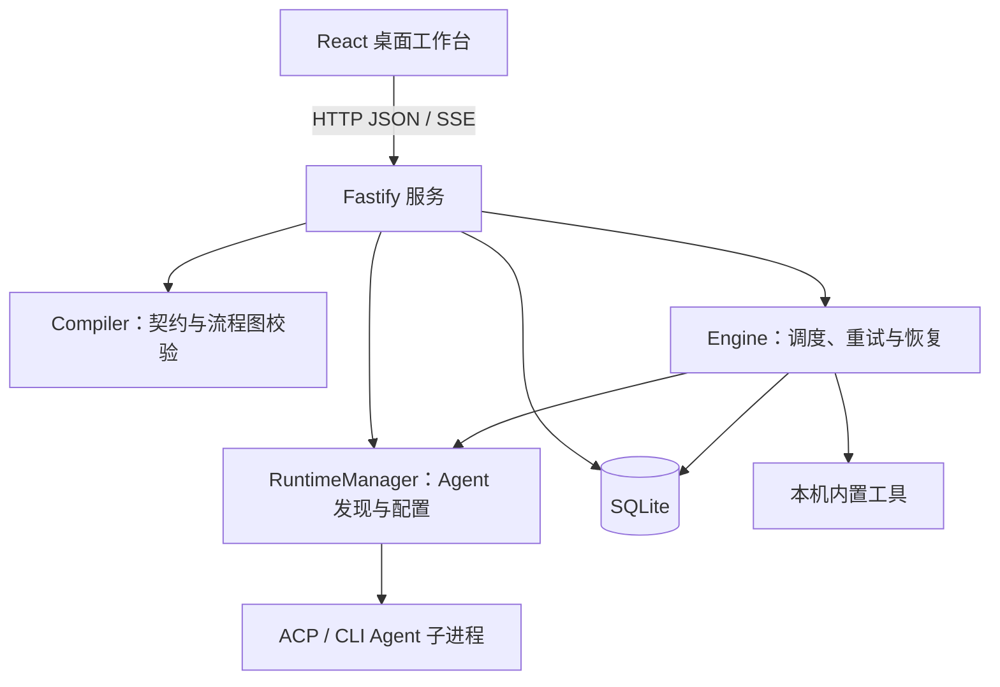

# CFlow

CFlow 是一个以 Flow 为核心的本机多 Agent 编排工作台。用户用自然语言描述目标，由助手生成流程草案，在桌面画布中调整、检查、测试、发布和运行，并通过运行记录追踪结果。

面向 HR、财务、运营等业务人员，CFlow 使用业务语言呈现步骤、条件和执行状态。支持 1280px 及以上的桌面浏览器，左右侧栏可调整宽度或收起。

## 安装与运行

需要 Node.js 22.13.0 或更高版本。在目标工作目录运行：

```bash
npx @hmj-ai/cflow
```

也可以全局安装：

```bash
npm install -g @hmj-ai/cflow
cd /path/to/your/workspace
cflow
```

正式 `cflow` 命令会在服务监听成功后自动打开浏览器，默认地址为 `http://127.0.0.1:3000`。设置 `CFLOW_NO_OPEN=1` 可以只启动服务而不打开页面。服务启动目录就是工作区，流程数据保存在该目录的 `.cflow/` 中。`PORT` 可设置端口；服务默认只监听回环地址，通过 `HOST` 对外提供访问前应配置认证和网络访问控制。

打开工作台后可以添加 Hello World 示例，使用内置演示执行器完成检查和测试，无需先配置 Agent。

## 核心模型

- **CF**：单个可复用能力，定义输入、输出和允许的操作，由 Agent 或内置工具执行。
- **Flow**：由能力调用、分支、汇合和输出节点组成的有向无环图，负责条件路由、并发和重试。
- **草稿**：可编辑的流程和能力配置。编辑修订号用于保存与并发校验。
- **发布版本**：固定流程计划、能力版本、运行时配置及哈希。每个流程首次发布为 `1.0.0`，后续基于已有发布版本递增，编辑、检查和测试不占用发布号。
- **Run**：一次测试或正式运行，记录输入、步骤状态、输出及执行事件。

典型工作流：描述目标 → 调整流程 → 检查 → 测试 → 发布 → 运行 → 查看结果。

内置文件内容提取能力可在本机读取 DOCX、XLSX、PPTX、文本型 PDF、CSV、Markdown、HTML、TXT、JSON 和 XML，供后续节点使用。它不调用 Agent，不执行宏，不进行 OCR 或修改源文件。

## 架构



### 模块职责

| 模块         | 位置                     | 职责                                               |
| ------------ | ------------------------ | -------------------------------------------------- |
| 桌面工作台   | `web/src/`               | 流程画布、能力配置、助手、检查与运行记录           |
| HTTP 服务    | `src/server.ts`          | API、工作区边界、草稿保存、编译与发布              |
| 编译器       | `src/compiler.ts`        | 输入输出契约、图结构与分支校验，生成执行计划和哈希 |
| 执行引擎     | `src/engine.ts`          | 节点调度、并发、重试、取消与恢复                   |
| Runtime 管理 | `src/runtime.ts`         | Agent 发现、健康检查、协议适配与输出校验           |
| 进程管理     | `src/runtime-process.ts` | 命令解析、工作目录、环境变量、超时与进程终止       |
| 数据存储     | `src/db.ts`              | 草稿、发布版本、运行状态、事件与任务队列           |
| 领域模型     | `src/types.ts`           | CF、Flow、Run、Runtime 和资源类型                  |

### 执行流程

1. 编译器校验能力契约、入口、可达性、环路、分支与终点，生成执行计划。
2. 服务绑定具体能力和 Runtime Profile 版本；检查和测试保存临时快照，发布保存独立版本。
3. 引擎创建运行任务，根据依赖和分支条件调度节点，将状态与结果写入有序事件记录。
4. Runtime 启动受控 Agent 子进程，内置工具直接在本机执行；结果按输出契约校验。
5. 工作台读取运行状态和事件，呈现结果及失败原因。恢复过程通过任务租约和事件记录避免盲目重放已发生的操作。

## 数据与工作区

```text
<workspace>/.cflow/
├── cflow.sqlite       # 工作区数据库
├── flows/             # 流程附件
├── agents.d/          # 项目级 Agent manifest
└── .gitignore         # 本机数据忽略规则
```

SQLite 使用 WAL 模式。主要数据包括能力和流程草稿、不可变发布版本、编译快照、运行记录、事件日志、任务队列、Runtime Profile 和资源配置。

一个工作区可管理多个流程。发布计划固定工作区、能力与运行时版本，后续编辑不会改变已有发布计划和运行历史。

## Agent 与执行边界

CFlow 随包提供 Codex 和 Claude Code 的 ACP 连接组件，但对应的 `codex` 或 `claude` CLI 仍须在本机安装；未找到 CLI 时，助手会显示为不可用。其他 ACP 或 CLI Agent 可通过 manifest 接入，配置可以来自 PATH、npm 包、用户目录或项目目录，项目配置优先。

在「工作台设置 → 本机助手」中选择「接入项目助手」，可以为当前项目创建或编辑外部 ACP 助手。填写助手名称、配置标识、启动命令和参数后，CFlow 会把配置写入 `.cflow/agents.d/`，立即重新识别并测试连接。新建时可套用 Pi Agent 示例；Pi 本身不直接支持 ACP，该示例通过社区 `pi-acp` 适配器连接，因此需先安装并登录 Pi。项目助手可以在同一处编辑或删除；当前默认助手需要先切换默认项才能删除。删除只影响新流程，已发布流程和历史运行仍保留固定的 Runtime Profile 版本。

用户级 manifest 位于 `~/.config/cflow/agents.d/`，项目级 manifest 位于 `.cflow/agents.d/`。Runtime Profile 按版本保存，发布流程引用具体版本。项目助手配置只保存允许传入的环境变量名称，不接收也不落盘密钥值；密钥必须由启动 CFlow 的环境提供。

子进程通过参数数组启动，使用限定的工作目录和环境变量，并受超时、输出大小与取消机制约束。操作权限依据能力声明和工作区范围决定；文件系统与网络隔离能力取决于具体适配器。

## 开发

```bash
pnpm install
pnpm run build
pnpm start
```

`pnpm start` 和 `pnpm run dev` 只启动服务，不会自动打开浏览器；自动开页仅用于安装包提供的 `cflow` 命令。

开发时分别启动后端和前端：

```bash
pnpm run dev       # 后端，默认 127.0.0.1:3000
pnpm run dev:web   # 前端，默认 127.0.0.1:5173，/api 代理到后端
```

验证命令：

```bash
pnpm test
pnpm run typecheck:web
pnpm run format:check
pnpm run build
```

技术栈：TypeScript、React、XYFlow、Fastify、SQLite、Vite 和 Agent Client Protocol。生产构建输出到 `dist/`。

产品定位见 [PRODUCT.md](./PRODUCT.md)，视觉规范见 [DESIGN.md](./DESIGN.md)。
