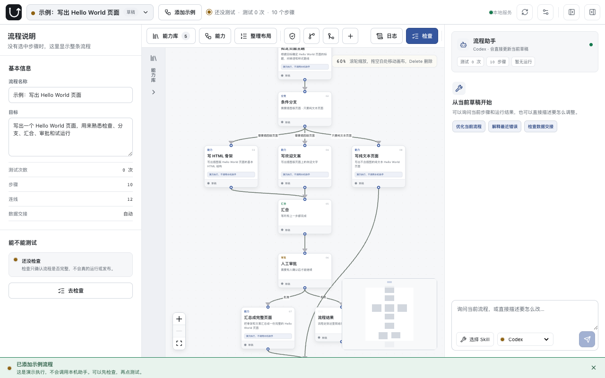
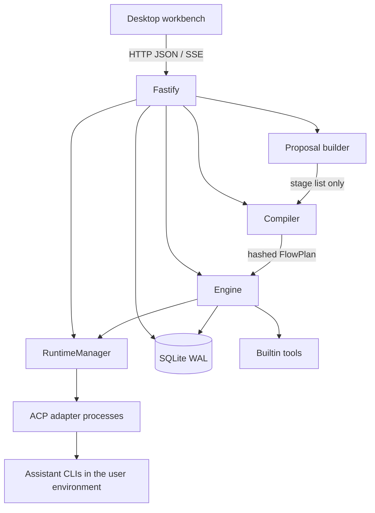

<p align="center">
  
</p>

# CFlow

[English](README.md) · [简体中文](README.zh-CN.md)

[](https://www.npmjs.com/package/@hmj-ai/cflow)
[](https://nodejs.org)
[](LICENSE)

A **local workbench for inspectable multi-agent workflow graphs**. Describe an objective in plain language, review the generated DAG on a desktop canvas, then check, test, publish, and run — with an auditable event ledger instead of a chat log.

CFlow is for desktop browsers at **1280px and wider**. Sidebars resize or collapse in place; there is no mobile or touch layout.



```bash
npx @hmj-ai/cflow
```

The workbench opens at `http://127.0.0.1:3000`. Add the Hello World example to check and test without configuring an assistant.

---

## What it is

CFlow belongs with **agent graphs** and visual **workflow** tools: reusable steps on a DAG, routed by branches and joins, executed by a scheduler.

In this codebase that graph is named a **Flow** — a compiled, versioned DAG of capabilities. Treat it as a domain term, not a new category. The interesting design is not the name; it is that **assistants never own the graph**.

It is **not RAG**. CFlow does not index a corpus or retrieve chunks as its core loop. The builtin file extractor is one node you can place on the graph so later agent steps can read documents.

| If you know                   | In CFlow                                                                                              |
| ----------------------------- | ----------------------------------------------------------------------------------------------------- |
| Agent graph (LangGraph-style) | A DAG of `cf-call`, `branch`, `join`, `output`. The compiler, not the agent, owns edges.              |
| Visual workflow               | Desktop canvas plus check / test / publish. Steps are contracted capabilities, not opaque HTTP nodes. |
| RAG / GraphRAG                | Not the model. Documents can feed a node; there is no retriever or vector index.                      |

---

## Core design

CFlow separates **what a step does** from **how the graph routes**. Assistants propose an ordered stage list; the server builds and validates the DAG.

### Capability (CF)

A CF is one reusable unit of work. It declares:

- a name and a `does` description
- optional input, output, and process guidance
- JSON Schema **input/output contracts**
- workspace-scoped **effects**: `file-read`, `file-write`, or `command`

Execution is either:

| Program | Meaning                                                        |
| ------- | -------------------------------------------------------------- |
| `v0.2`  | An Agent task compiled from the draft. No nested control flow. |
| `v0.3`  | A versioned builtin tool identity. Today: `file.extract-text`. |

A CF program is a task (or a tool id), not a nested graph. Branching, joining, retry, and termination live on the DAG.

### Workflow graph

A workflow graph (a **Flow** in CFlow types) is a **directed acyclic graph** of:

| Node      | Role                                                 |
| --------- | ---------------------------------------------------- |
| `cf-call` | Invoke a CF, optionally with retry (`onError`)       |
| `branch`  | Route by a natural-language condition to named cases |
| `join`    | Wait for `all` or `any` upstream paths               |
| `output`  | Terminal result                                      |

Edges start from `$entry` and carry an outcome: `completed`, `failed`, or `branch-case`. The compiler — not the canvas, not the assistant — is the source of a runnable plan.

### Assistants propose stages; the server owns the graph

When you describe a goal or ask the workbench assistant to revise a draft, the runtime may return an **ordered stage list**: capability steps and top-level branches. It must not emit raw edges, joins, hashes, or published versions.

The server then:

1. Builds nodes, edges, and joins **deterministically** from that list.
2. Compiles contracts and graph structure.
3. Saves a draft you can still edit.

That split is intentional: an assistant can suggest _what should happen_; it cannot hand CFlow an unvalidated graph.

### Draft, snapshot, published version

| Artifact                  | Mutable | Version number                      | Role                                                                    |
| ------------------------- | ------- | ----------------------------------- | ----------------------------------------------------------------------- |
| **Draft**                 | Yes     | `revision` (optimistic concurrency) | What you edit on the canvas                                             |
| **Check / test snapshot** | No      | None                                | Temporary compiled plan; does not consume a publish number              |
| **Published `FlowPlan`**  | No      | `1.0.0`, then `2.0.0`, …            | Pinned CF versions, Runtime Profile versions, workspace, and `planHash` |

Editing, checking, and testing never bump the publish number. The first publish of a graph is `1.0.0`; later publishes increment from existing published versions. A published plan is immutable: later draft edits do not rewrite history or in-flight runs.

### Runs are ledger-driven

A **Run** is one test or production execution. The engine:

1. Verifies `planHash` before dispatch.
2. Reconstructs node state from the ordered **event ledger**.
3. Admits ready nodes under `maxConcurrency` and `maxNodeDispatches`.
4. Retries a CF only when the error is retryable **and** the effect state is known (`none` / `started` / `committed`).
5. Marks the run `needs-reconciliation` if a node was started but not finished, or if effect state is `unknown` — it does **not** blindly replay a side-effecting step.

The workbench reads that ledger over HTTP and SSE and shows business-language status; technical facts stay available on demand.

---

## Architecture



| Module            | Path                                   | Responsibility                                                            |
| ----------------- | -------------------------------------- | ------------------------------------------------------------------------- |
| Desktop workbench | `web/src/`                             | Canvas, capability library, assistant, check, run log                     |
| HTTP server       | `src/server.ts`                        | Workspace boundary, drafts, compile, publish, SSE                         |
| Proposal          | `src/proposal.ts`, `src/flow-agent.ts` | Turn a stage list into a FlowDraft; assistant may answer or revise stages |
| Compiler          | `src/compiler.ts`                      | Contracts, DAG rules, hashed `FlowPlan`                                   |
| Engine            | `src/engine.ts`                        | Dispatch, concurrency, retry, cancel, recovery                            |
| Runtime           | `src/runtime.ts`                       | Agent discovery, health, ACP, output validation                           |
| Process layer     | `src/runtime-process.ts`               | Command resolution, cwd, env allowlist, timeout, termination              |
| Store             | `src/db.ts`                            | Drafts, versions, snapshots, runs, ledger, job leases, profiles           |
| Domain types      | `src/types.ts`                         | CF, Flow, Run, Runtime, resources                                         |

### Compile → bind → execute

1. **Compile.** Validate CF contracts and effects; require a workspace root, an entry, full reachability, no cycles, complete branch cases, and at least one terminal `output`. Emit `FlowPlan` v0.6 plus `planHash`.
2. **Bind.** Check and test store a snapshot. Publish inserts an immutable version and **pins** each `cf-call` to a Runtime Profile version (builtin tools have no executor pin).
3. **Execute.** The engine claims a job lease, restores state from the ledger, and dispatches ready nodes. Agent CFs start a controlled ACP child process; builtin tools run locally. Outputs are checked against the CF contract.
4. **Observe.** The workbench tails run events. Recovery uses leases and the ledger so a restart does not replay committed work.

---

## Install

Requires **Node.js 22.13.0** or later.

```bash
npx @hmj-ai/cflow
```

Or install globally:

```bash
npm install -g @hmj-ai/cflow
cd /path/to/your/workspace
cflow
```

The directory you start in **is** the workspace. Graph data is stored in `.cflow/` under that directory.

| Variable        | Default     | Purpose                                                               |
| --------------- | ----------- | --------------------------------------------------------------------- |
| `PORT`          | `3000`      | Listen port                                                           |
| `HOST`          | `127.0.0.1` | Bind address. The process listens on loopback unless you change this. |
| `CFLOW_NO_OPEN` | unset       | Set to `1` to start the server without opening a browser              |

The packaged `cflow` command opens the browser after listen succeeds. Before binding `HOST` to a non-loopback address, put authentication and network access control in front of the process — CFlow does not ship a remote auth layer.

---

## Usage

Typical path:

**Describe an objective → adjust the graph → check → test → publish → run → inspect the ledger.**

1. Start CFlow in the project directory that should own the files.
2. Open the workbench and either add **Hello World** (uses the builtin demo executor) or describe a real objective to the workbench assistant.
3. Edit steps, branches, and joins on the canvas. Capability copy is business language; contracts and effects stay inspectable.
4. **Check** compiles the current draft and reports graph/contract problems. It does not run agents.
5. **Test** compiles a snapshot, pins currently available runtimes, and executes a Run without publishing.
6. **Publish** freezes a `FlowPlan`. **Run** executes that published plan.
7. Open the run log for step status, outputs, and failure detail.

### Builtin file extraction

`builtin:file.extract-text` reads workspace files locally and returns text plus source structure (pages, sheets, slides). Supported formats: **DOCX, XLSX, PPTX, text PDF, CSV, Markdown, HTML, TXT, JSON, XML**.

It does not call an assistant, does not execute macros, does not OCR, and does not modify source files. Input is configured **per graph node** (explicit paths, graph input, or a direct upstream output). Paths must be workspace-relative regular files; symlinks are rejected.

---

## Agents and execution boundary

CFlow talks to assistants through **ACP** ([Agent Client Protocol](https://agentclientprotocol.com)). The npm package bundles Codex and Claude Code **protocol adapters**. Those adapters are not the assistants. The real `codex`, `claude`, and other CLIs must already exist in the environment that launched CFlow.

If the configured CLI is missing, the assistant shows as unavailable.

| Default assistant | ACP adapter command | User CLI | Path variable passed to the adapter |
| ----------------- | ------------------- | -------- | ----------------------------------- |
| Codex             | `codex-acp`         | `codex`  | `CODEX_PATH`                        |
| Claude Code       | `claude-agent-acp`  | `claude` | `CLAUDE_CODE_EXECUTABLE`            |

The adapter command starts an ACP server. The user CLI is what CFlow probes for a real install. The path variable hands that absolute path to the adapter. Assistants that speak ACP natively only need the adapter command.

Codex and Claude Code health checks open a temporary ACP session **without sending a prompt**, so they verify the CLI, login, and model endpoint together.

Set provider credentials in the **same** environment that starts CFlow, then fully restart after changing them. CFlow forwards, but never writes into project files or browser storage:

- Claude / Anthropic: `ANTHROPIC_API_KEY`, `ANTHROPIC_BASE_URL`, `ANTHROPIC_MODEL`, plus the official OAuth, proxy, Bedrock, and Vertex variables
- Codex: `CODEX_API_KEY` or `OPENAI_API_KEY`

Unauthenticated assistants are marked unavailable, with a prompt to sign in as the same OS user that started CFlow.

**Workbench → Local assistants** lists the bundled Codex and Claude Code presets. You can override command, user CLI, args, and the environment-variable **allowlist** per project, or restore defaults. **Connect a project assistant** adds other ACP agents (a Pi Agent example is included; Pi itself is not ACP-native, so install and log into the community `pi-acp` adapter first).

Discovery order, later wins: PATH, npm package, `~/.config/cflow/agents.d/`, `.cflow/agents.d/`. Runtime Profiles are versioned; a published graph pins a specific profile version. Deleting an assistant config affects new graphs only.

Manifests store **names** of allowed environment variables, never secret values. Child processes start from an argv array, a bounded working directory, an allowlisted environment, timeouts, output-size limits, and cancellation. What an Agent may do follows the CF's declared effects and the workspace root. Filesystem and network isolation then depend on the adapter.

Windows: CFlow follows npm `.cmd` shims. Codex is launched through the system shell at `codex.cmd`. Claude Code shims are resolved to `cli.js` or `claude.exe` in the user install; unresolved shims stay unavailable. CFlow will not fall back to an executable bundled inside the adapter.

---

## Workspace data

```text
<workspace>/.cflow/
├── cflow.sqlite       # drafts, versions, snapshots, runs, ledger, jobs, profiles
├── flows/             # graph attachments
├── agents.d/          # project-level Agent manifests
└── .gitignore         # managed ignore rules for local data
```

SQLite runs in WAL mode. One workspace can hold many graphs. A published plan freezes workspace root, capability versions, and runtime versions for that run history.

Do not set `CF_DB`; the database path is derived from the workspace directory.

---

## Development

```bash
pnpm install
pnpm run build
pnpm start
```

`pnpm start` and `pnpm run dev` start the server only. Auto-opening the browser is limited to the packaged `cflow` command.

```bash
pnpm run dev       # API, 127.0.0.1:3000
pnpm run dev:web   # Vite, 127.0.0.1:5173, /api proxied to the backend
```

```bash
pnpm test
pnpm run typecheck:web
pnpm run format:check
pnpm run build
```

Stack: TypeScript, React, XYFlow, Fastify, SQLite, Vite, [Agent Client Protocol](https://agentclientprotocol.com). Production output is `dist/`.

Product intent: [PRODUCT.md](./PRODUCT.md). Visual rules: [DESIGN.md](./DESIGN.md).

---

## Scope

- Desktop browser workbench only (1280px+). No mobile, touch, or narrow-layout support.
- Local process. Not a hosted multi-tenant service.
- Assistants run as subprocesses of the user who started CFlow, with workspace-scoped effects.

## License

[ISC](LICENSE)
