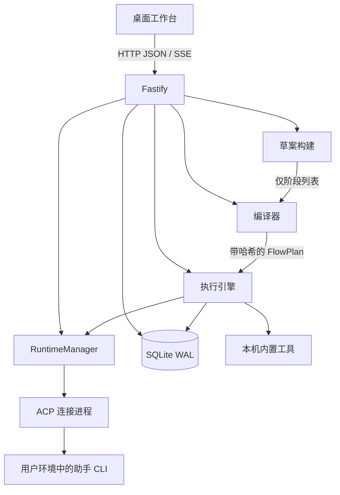

<p align="center">
  
</p>

# CFlow

[English](README.md) · [简体中文](README.zh-CN.md)

[](https://www.npmjs.com/package/@hmj-ai/cflow)
[](https://nodejs.org)
[](LICENSE)

CFlow 是一个面向可审阅的 **多 Agent 工作流图** 的本机工作台。用自然语言描述目标，在桌面画布上审阅生成的 DAG，再检查、测试、发布和运行；结果落在可审计的事件记录里，而不是一份聊天记录。

面向 **1280px 及以上的桌面浏览器**。左右侧栏可改宽度或收起；不提供移动端、触控端或窄屏布局。


```bash
npx @hmj-ai/cflow
```

工作台默认打开 `http://127.0.0.1:3000`。可先添加 Hello World 示例，用内置演示执行器完成检查和测试，不必先配置助手。

---

## 它是什么

CFlow 和 **Agent 图**、可视化 **工作流** 工具是一类东西：可复用步骤组成 DAG，用分支和汇合路由，由调度器执行。

在本仓库里，这份图的类型名是 **Flow**——一份已编译、带版本的能力 DAG。把它当成领域术语，而不是新品类。真正要看的不是这个名字，而是 **助手不拥有图**。

它 **不是 RAG**。CFlow 的核心循环不是建索引、也不是检索切片。内置文件提取只是可以放到图上的一种节点，好让后续 Agent 步骤读取文档。

| 如果你熟悉                 | 在 CFlow 里                                                                         |
| -------------------------- | ----------------------------------------------------------------------------------- |
| Agent 图（LangGraph 一类） | `cf-call`、`branch`、`join`、`output` 组成的 DAG。边由编译器拥有，不由 Agent 拥有。 |
| 可视化工作流               | 桌面画布 + 检查 / 测试 / 发布。步骤是带契约的能力，不是不透明的 HTTP 节点。         |
| RAG / GraphRAG             | 不是这套模型。文档可以喂给某个节点；没有检索器，也没有向量索引。                    |

---

## 核心设计

CFlow 把 **步骤做什么** 和 **图如何路由** 分开。助手只提出有序阶段列表；服务端负责建图并校验。

### 能力（CF）

CF 是一个可复用的工作单元，声明：

- 名称与 `does` 说明
- 可选的输入、输出、过程约束
- JSON Schema **输入 / 输出契约**
- 限定在工作区内的 **副作用**：`file-read`、`file-write` 或 `command`

执行只有两种：

| Program | 含义                                               |
| ------- | -------------------------------------------------- |
| `v0.2`  | 由草稿编译出的 Agent 任务。不含内部控制流。        |
| `v0.3`  | 带版本的内置工具标识。当前为 `file.extract-text`。 |

CF 程序是任务（或工具 id），不是嵌套的图。分支、汇合、重试和终止都在 DAG 上。

### 工作流图

工作流图（CFlow 类型里的 **Flow**）是由下列节点组成的 **有向无环图**：

| 节点      | 作用                              |
| --------- | --------------------------------- |
| `cf-call` | 调用一个能力，可选 `onError` 重试 |
| `branch`  | 按自然语言条件路由到具名分支      |
| `join`    | 等待上游 `all` 或 `any`           |
| `output`  | 终点结果                          |

边从 `$entry` 出发，带结果条件：`completed`、`failed` 或 `branch-case`。可运行计划的来源是编译器，不是画布，也不是助手。

### 助手只提出阶段，服务端拥有图

描述目标，或让工作台助手修改当前草稿时，运行时最多返回一份 **有序阶段列表**：能力步骤和顶层分支。它不能输出原始边、汇合、哈希或发布版本。

随后由服务端：

1. 按该列表 **确定性** 生成节点、边和汇合；
2. 校验契约与图结构；
3. 写入仍可继续编辑的草稿。

这个分界是刻意的：助手可以建议 _应当发生什么_，但不能把一份未经校验的图交给 CFlow。

### 草稿、快照、发布版本

| 产物                  | 可改 | 版本号                   | 作用                                                    |
| --------------------- | ---- | ------------------------ | ------------------------------------------------------- |
| **草稿**              | 是   | `revision`（乐观并发）   | 画布上正在编辑的内容                                    |
| **检查 / 测试快照**   | 否   | 无                       | 临时编译计划，不占用发布号                              |
| **已发布 `FlowPlan`** | 否   | `1.0.0`，之后 `2.0.0`，… | 固定能力版本、Runtime Profile 版本、工作区与 `planHash` |

编辑、检查和测试都不会递增发布号。每张图首次发布为 `1.0.0`，之后按已有发布版本递增。已发布计划不可变：后续改草稿不会改写历史或进行中的运行。

### 运行由事件账本驱动

**Run** 是一次测试或正式执行。引擎会：

1. 调度前校验 `planHash`；
2. 从有序 **事件账本** 重建节点状态；
3. 在 `maxConcurrency` 与 `maxNodeDispatches` 限制下接纳就绪节点；
4. 仅在错误可重试 **且** 副作用状态已知（`none` / `started` / `committed`）时重试；
5. 若节点已 `started` 但未结束，或副作用状态为 `unknown`，则进入 `needs-reconciliation`，**不会** 盲目重放可能已产生副作用的步骤。

工作台通过 HTTP 和 SSE 读取账本，用业务语言呈现状态；技术细节按需展开。

---

## 架构



| 模块       | 位置                                   | 职责                                           |
| ---------- | -------------------------------------- | ---------------------------------------------- |
| 桌面工作台 | `web/src/`                             | 画布、能力库、助手、检查、运行记录             |
| HTTP 服务  | `src/server.ts`                        | 工作区边界、草稿、编译、发布、SSE              |
| 草案       | `src/proposal.ts`、`src/flow-agent.ts` | 把阶段列表做成 FlowDraft；助手可回答或改阶段   |
| 编译器     | `src/compiler.ts`                      | 契约、图规则、带哈希的 `FlowPlan`              |
| 执行引擎   | `src/engine.ts`                        | 调度、并发、重试、取消、恢复                   |
| Runtime    | `src/runtime.ts`                       | 助手发现、健康检查、ACP、输出校验              |
| 进程层     | `src/runtime-process.ts`               | 命令解析、工作目录、环境变量白名单、超时与终止 |
| 存储       | `src/db.ts`                            | 草稿、版本、快照、运行、账本、任务租约、配置   |
| 领域模型   | `src/types.ts`                         | CF、Flow、Run、Runtime、资源                   |

### 编译 → 绑定 → 执行

1. **编译。** 校验能力契约与副作用；要求有工作区根目录、入口、全部可达、无环、分支完整、至少一个终点 `output`。生成 `FlowPlan` v0.6 和 `planHash`。
2. **绑定。** 检查和测试写入快照。发布写入不可变版本，并把每个 `cf-call` **钉死** 到具体 Runtime Profile 版本（内置工具不钉执行器）。
3. **执行。** 引擎领取任务租约，从账本恢复状态，调度就绪节点。Agent 能力启动受控 ACP 子进程；内置工具在本机执行。结果按能力输出契约校验。
4. **观察。** 工作台跟踪运行事件。恢复依赖租约和账本，重启不会重放已提交的工作。

---

## 安装

需要 **Node.js 22.13.0** 或更高版本。

```bash
npx @hmj-ai/cflow
```

也可以全局安装：

```bash
npm install -g @hmj-ai/cflow
cd /path/to/your/workspace
cflow
```

启动时所在目录就是工作区。图数据保存在该目录的 `.cflow/` 中。

| 变量            | 默认值      | 作用                                |
| --------------- | ----------- | ----------------------------------- |
| `PORT`          | `3000`      | 监听端口                            |
| `HOST`          | `127.0.0.1` | 绑定地址。默认只监听回环。          |
| `CFLOW_NO_OPEN` | 未设置      | 设为 `1` 时只启动服务，不打开浏览器 |

正式 `cflow` 命令在监听成功后会打开浏览器。把 `HOST` 绑到非回环地址前，应自行配置认证和网络访问控制——CFlow 不内置远程鉴权。

---

## 使用

典型路径：

**描述目标 → 调整工作流图 → 检查 → 测试 → 发布 → 运行 → 查看账本。**

1. 在应当拥有相关文件的项目目录启动 CFlow。
2. 打开工作台：添加 **Hello World**（走内置演示执行器），或向工作台助手描述真实目标。
3. 在画布上改步骤、分支和汇合。步骤文案是业务语言；契约和副作用可随时查看。
4. **检查** 编译当前草稿并报告图 / 契约问题，不会调用助手。
5. **测试** 编译快照、绑定当前可用运行时，执行一次 Run，但不发布。
6. **发布** 冻结一份 `FlowPlan`。**运行** 执行该发布计划。
7. 在运行记录里查看步骤状态、输出和失败原因。

### 内置文件内容提取

`builtin:file.extract-text` 在本机读取工作区文件，返回正文和来源结构（页码、工作表、幻灯片）。支持 **DOCX、XLSX、PPTX、文本型 PDF、CSV、Markdown、HTML、TXT、JSON、XML**。

它不调用助手，不执行宏，不做 OCR，也不修改源文件。输入按 **图节点** 配置（显式路径、图输入，或直接上游输出）。路径必须是工作区相对路径下的普通文件；符号链接会被拒绝。

---

## Agent 与执行边界

CFlow 通过 **ACP**（[Agent Client Protocol](https://agentclientprotocol.com)）连接助手。安装包中的 Codex 和 Claude Code 组件只是 **协议转换适配器**，不是用户助手。真正执行任务的 `codex`、`claude` 等 CLI 必须已经存在于启动 CFlow 的环境中。

找不到配置指定的 CLI 时，助手显示为不可用。

| 默认助手    | ACP 连接命令       | 用户 CLI | 传给适配器的路径变量     |
| ----------- | ------------------ | -------- | ------------------------ |
| Codex       | `codex-acp`        | `codex`  | `CODEX_PATH`             |
| Claude Code | `claude-agent-acp` | `claude` | `CLAUDE_CODE_EXECUTABLE` |

连接命令启动 ACP Server；用户 CLI 用于探测真实安装；路径变量把绝对路径交给适配器。原生支持 ACP 的助手可以只填连接命令。

Codex 和 Claude Code 的健康检查会创建一个 **不发送提示词** 的临时 ACP 会话，同时验证 CLI、登录状态和模型服务。

请在启动 CFlow 的 **同一环境** 中设置供应商凭证，变更后完全重启。CFlow 会转发这些变量，但不会写入项目文件或浏览器存储：

- Claude / Anthropic：`ANTHROPIC_API_KEY`、`ANTHROPIC_BASE_URL`、`ANTHROPIC_MODEL`，以及官方 OAuth、代理、Bedrock、Vertex 相关变量
- Codex：`CODEX_API_KEY` 或 `OPENAI_API_KEY`

未认证时助手显示为不可用，并提示在启动 CFlow 的同一系统用户下完成登录。

「工作台设置 → 本机助手」列出预先配置的 Codex 和 Claude Code。可以按项目覆盖连接命令、助手 CLI、参数和环境变量 **白名单**，也可以恢复默认。「接入项目助手」可添加其他 ACP 助手（含 Pi Agent 示例；Pi 本身不直接支持 ACP，需先安装并登录社区 `pi-acp` 适配器）。

发现顺序后者优先：PATH、npm 包、`~/.config/cflow/agents.d/`、`.cflow/agents.d/`。Runtime Profile 按版本保存，已发布的图引用具体版本。删除助手配置只影响新图。

清单只保存允许传入的环境变量 **名称**，不接收也不落盘密钥。子进程用参数数组启动，工作目录、环境变量白名单、超时、输出大小和取消都有边界。操作权限依据能力声明的副作用和工作区范围；文件系统与网络隔离取决于具体适配器。

Windows 会解析 npm 生成的 `.cmd` 代理。Codex 通过系统 shell 调用 `codex.cmd`；Claude Code 会从 shim 解析用户安装目录下的 `cli.js` 或 `claude.exe`。无法解析的 shim 显示为不可用。CFlow 不会改用适配器随附的执行文件。

---

## 数据与工作区

```text
<workspace>/.cflow/
├── cflow.sqlite       # 草稿、版本、快照、运行、账本、任务、配置
├── flows/             # 图附件
├── agents.d/          # 项目级 Agent manifest
└── .gitignore         # 本机数据忽略规则
```

SQLite 使用 WAL。一个工作区可管理多张图。发布计划会固定该次运行所使用的工作区、能力版本与运行时版本。

不要设置 `CF_DB`；数据库路径由工作区目录推导。

---

## 开发

```bash
pnpm install
pnpm run build
pnpm start
```

`pnpm start` 和 `pnpm run dev` 只启动服务。自动打开浏览器仅用于安装包提供的 `cflow` 命令。

```bash
pnpm run dev       # 后端，127.0.0.1:3000
pnpm run dev:web   # 前端，127.0.0.1:5173，/api 代理到后端
```

```bash
pnpm test
pnpm run typecheck:web
pnpm run format:check
pnpm run build
```

技术栈：TypeScript、React、XYFlow、Fastify、SQLite、Vite、[Agent Client Protocol](https://agentclientprotocol.com)。生产构建输出到 `dist/`。

产品定位见 [PRODUCT.md](./PRODUCT.md)，视觉规范见 [DESIGN.md](./DESIGN.md)。

---

## 范围

- 仅桌面浏览器工作台（1280px+）。不实现移动端、触控端或窄屏布局。
- 本机进程，不是托管的多租户服务。
- 助手作为启动 CFlow 的用户的子进程运行，副作用限定在工作区。

## 许可

[ISC](LICENSE)
